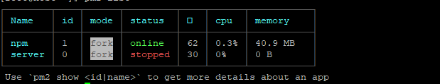

	原项目为VUE 单页应用, 因需要更好的SEO（单页应用不利于SEO）, 遂采用了vue 生态的 nuxt 来对原来的项目进行改造。
## 项目技术使用 
	项目使用 vue , vue-router, vuex, nuxt
	服务端环境  centos6, pm2, nginx, node
	服务端使用pm2 做node进程管理工具

## 对项目进行改造

1. 首先就是对 [NUXT](https://zh.nuxtjs.org/) 熟悉一下，此处要注意下 nuxt 对文件的目录是有规定的，了解下那些目录都是用来做什么的。
2. 熟悉完之后，就可以开始对项目进行改造了 , 其实如果 项目不是需要重构 或者只是一些静态数据之类, 可以简单的 vue项目下的 所有页面全部放入components 文件夹下， 然后再pages 文件夹下构建对应的页面路径, 并在对应的页面下引入之前vue项目中的页面作为组件来使用, 这样我们更改地方比较少, 能够更快的进行 改造。
(注意: 这种操作方式适合纯静态类页面)
3. 本地启动nuxt项目

```base
	npm run dev  	// 开发环境下启动
	npm run build 	// 构建打包
	npm run start 	// 在start 之前 需要执行build 命令
```

##调试....
自行调试 如有问题, 看相应文档基本可以解决
当本地调试可以之后 即可着手 实施部署了

##服务端部署
nginx 安装采用喜好引擎搜索即可。
这里我们使用nginx 做代理
nuxt 启动后默认运行端口为3000，所以
```bash
nginx.conf

server {
	listen 80 ;	
	server_name example.abc.com;

	location / {
			proxy_redirect                      off;
			proxy_set_header Host               $host;
			proxy_set_header X-Real-IP          $remote_addr;
			proxy_set_header X-Forwarded-For    $proxy_add_x_forwarded_for;
			proxy_set_header X-Forwarded-Proto  $scheme;
			proxy_read_timeout          1m;
			proxy_connect_timeout       1m;

			proxy_pass http://localhost:3000;
	}
}
```

采用[pm2](https://pm2.io/doc/en/runtime/quick-start/)来做进程管理，pm2相关可取官网查询。

将 .nuxt文件夹 nuxt.config.js package.json 上传到服务端 相应目录下(自行选择, 例如: /var/www/html);

进入 /var/www/html 安装项目依赖 (此处默认服务端以安装node, 如果未安装请先安装node)
```bash
npm i
```

pm2 启动项目
```bash
pm2 start npm -- run start
```

启动正常后可以看到


此处id 为1 的即是 我们在服务端启动的 nuxt 项目

这时 启动nginx  
```bash
nginx
```
访问 example.abc.com; 页面正常喧染。 vue spa 项目 改为 ssr 结束。
(注意: 服务端时没有 window, document 对象的, 所以这部分要在 浏览器喧染， 可以采用nuxt 的 <no-srr/> 组件)。

